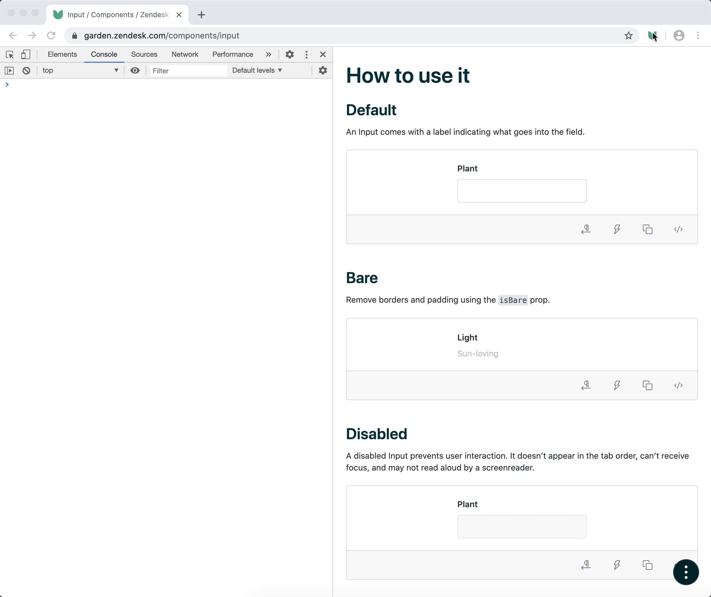

# Garden Inspect [![Build Status][build status badge]][build status link] [![Chrome Web Store][chrome web store badge]][chrome web store link]<!-- markdownlint-disable -->

<!-- markdownlint-enable -->

[build status badge]: https://flat.badgen.net/circleci/github/zendeskgarden/chrome-extension/main?label=build
[build status link]: https://circleci.com/gh/zendeskgarden/chrome-extension/tree/main
[chrome web store badge]: https://flat.badgen.net//chrome-web-store/v/blipmdconlkpinefehnmjammfjpmpbjk
[chrome web store link]: https://chrome.google.com/webstore/detail/blipmdconlkpinefehnmjammfjpmpbjk

> :seedling: Garden is a design system for Zendesk

This repo contains the source code for the Garden Inspect browser extension.

## Installation

Add the [Chrome
extension](https://chrome.google.com/webstore/detail/blipmdconlkpinefehnmjammfjpmpbjk)
to your browser.

## Usage

The graphic below illustrates browser extension usage. Simply click the
extension icon – or press `Ctrl`+`Shift`+`G` – to toggle Garden Inspect.
Features include:

- Color highlighting indicating Garden
  [component](https://github.com/zendeskgarden/react-components) freshness
  - Green = up-to-date
  - Yellow = time to update
  - Red = out-of-date
- Dashed outlines to indicate Garden
  [container](https://github.com/zendeskgarden/react-containers) usage
- Overlay tooltips with component information
- Console logging with component IDs and versions

## Contribution

Thanks for your interest in Garden! Community involvement helps make our
design system fresh and tasty for everyone.

Got issues with what you find here? Feel free to create an
[issue](https://github.com/zendeskgarden/template/issues/new). Follow the
[contributing](.github/CONTRIBUTING.md) documentation for details needed to
submit a PR.

Community behavior is benevolently ruled by a [code of
conduct](.github/CODE_OF_CONDUCT.md). Please participate accordingly.

## License

Copyright 2020 Zendesk

Licensed under the [Apache License, Version 2.0](LICENSE.md)
