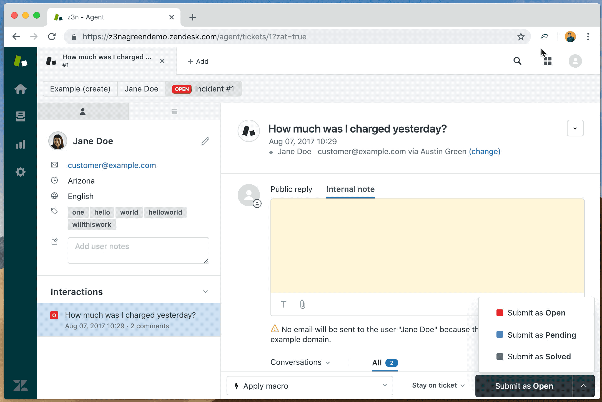

## Garden Audit - Chrome Extension

This browser extension allows users to easily audit which Garden components are visible on a page.

It includes:

- Visual audit with overlays
  - Includes tooltips with component IDs and their versions
- In your console:
  - Table of Garden components found in your console
  - Notification of whether Garden Chrome is found

### Installation Instructions

To install locally:

1. Navigate to [chrome://extensions/](chrome://extensions/)
1. Choose the `Load Unpacked` option
1. Select this folder to install the extension locally

### Usage Instructions

To trigger an audit:

- Select the extension icon, or
- Use the `CTRL + SHIFT + G` keyboard shortcut

Perform the same action to remove an audit.
